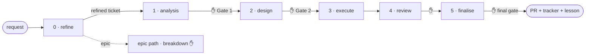

# mango-plugins


[](https://github.com/cuongdinhngo/mango-plugins/actions/workflows/validate.yml)

A Claude Code **marketplace** hosting [`mango`](./plugins/mango) — a portable, gated
ticket-lifecycle harness.

**The problem it solves:** an AI coding agent will happily report "done" on a ticket it half-finished
— a requirement skipped, a test that proves nothing, an edge it never touched. mango routes every
ticket through **gates that emit counted, checkable artifacts**, so you approve a diff on evidence,
not vibes. Each phase stops and waits for you (✋); silence is never approval.

What you get on every ticket:

- A **requirements matrix** with counts — nothing slips through unnamed.
- A **proving test at the right layer** — a runtime requirement can't be closed by a unit-mock proof.
- An independent, **ticket-blind challenger** that reconstructs the requirements from the diff alone
  and flags anything unmet.
- A **PR + tracker update + durable lesson**, each behind explicit per-action approval.

> **Status: 1.7.0 — stable API.** Proven across multiple real projects (two stacks) by its author,
> with a green behavioural eval and fault-injection-tested escalation paths; the public skill/config
> API has been stable since 1.0. The new epic-path (`breakdown`) is v1 — designed to run and be
> corrected by retro. Independent-operator validation is ongoing.

## The lifecycle



**`refine` (Phase 0)** runs first: it scans the project and **exposes the unresolved product-decisions**
— resolving the *how* ones with a citation and asking you the *want* ones — then **self-skips** when the
ticket is already clear, so it is never a tax. It **never authors your intent**. The four downstream
phases are gated end to end (plus a **Gate 0** for clarifications when the ticket is ambiguous). An
**epic** routes to the epic path (thin epic-level analysis/design → **`breakdown`** into tickets, human-
approved before any executes — v1). `/mango:solve <KEY>` runs the whole thing; you can also invoke any
phase directly. Trivial fixes take the lite lane, `/mango:quick <KEY>`. Full phase-by-phase detail, the
lite/full tiers, the frontend track, and the model-delegation map are in the
**[plugin README](./plugins/mango/README.md)**.

## Install

In Claude Code:

```
/plugin marketplace add cuongdinhngo/mango-plugins
/plugin install mango@mango-plugins
```

## Your first ticket

Bootstrap the per-project contract once, then run a ticket:

```
/mango:init      # detects your stack, writes .harness.json, scaffolds a starter rule book
/mango:doctor    # health-checks the setup (✅/⚠/❌ with remediation)
/mango:solve PROJ-123
```

`/mango:init` marks every guessed value `UNVERIFIED` for you to confirm, and asks whether
`.harness.json` is committed (shared team config) or kept local (gitignored). Either way it writes
**no secrets** — tokens live only in a gitignored `.env`. Prefer to fill it by hand? Copy
`<plugin>/config/harness.example.json` to `.harness.json` and edit `rulebook_path`, `repos`,
`test_command`, `tracker`, and `ticket_header_schema`.

No rule book yet, or a thin one? Run `/mango:codify` — it **counts** the conventions your code and
schema already use, asks **you** to choose each standard, and records them as provisional until you
ratify. mango facilitates the rule book; it never writes the rules for you.

## Skills at a glance

**Lifecycle** (run a ticket): `refine` (Phase 0 — expose the decisions, self-skip when clear) →
`analysis` · `design` · `execute` · `review` · `finalise` (gated end to end), orchestrated by `solve`,
with `quick` as the lite lane and `breakdown` splitting an epic into tickets on the epic path.

**Supporting** (setup / diagnostics / maps, not gated): `init` · `doctor` · `codify` ·
`version-check` · `budget`, plus opt-in descriptive maps `sitemap` (code surface) and `db-map`
(database schema).

See the [plugin README](./plugins/mango/README.md) for what each produces.

## Update

```
/plugin marketplace update mango-plugins
/plugin install mango@mango-plugins
```

## Contributing

Validating, running the behavioural eval, and publishing are covered in
[CONTRIBUTING.md](./CONTRIBUTING.md).

## License

MIT — see [LICENSE](./LICENSE).
