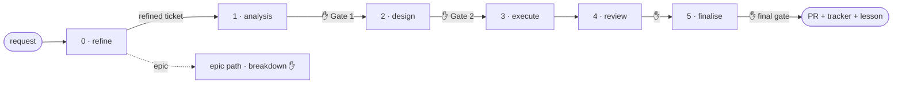

# mango-plugins


[](https://github.com/cuongdinhngo/mango-plugins/actions/workflows/validate.yml)

**mango** is a portable, gated ticket-lifecycle harness for Claude Code — it runs a ticket from
request to PR through phases you approve one at a time. This repo is the **marketplace** that hosts
it ([`plugins/mango`](./plugins/mango)).

**The problem it solves:** an AI coding agent will happily report "done" on a ticket it half-finished
— a requirement skipped, a test that proves nothing, an edge it never touched. mango routes every
ticket through **gates that emit counted, checkable artifacts**, so you approve a diff on evidence,
not vibes. Each phase stops and waits for you (✋); silence is never approval.

What you get on every ticket:

- A **requirements matrix** with counts — nothing slips through unnamed.
- A **proving test at the right layer** — a runtime requirement can't be closed by a unit-mock proof.
- An independent **challenger** that never sees the work — it rebuilds the requirements from the raw
  ticket and flags anything the diff leaves unmet.
- A **PR + tracker update + durable lesson**, each behind explicit per-action approval.

> Field-proven on multiple real projects across several stacks, including a large-scale production
> codebase, with a behavioural eval suite — one fixture per behaviour, green at each release — and
> fault-injection-tested escalation paths; the public skill/config API has been stable since 1.0.
> **Used by engineers beyond its author** — including a maintainer of a major open-source frontend
> framework — on their own projects.

## Install

In Claude Code:

```
/plugin marketplace add cuongdinhngo/mango-plugins
/plugin install mango@mango-plugins
```

## Your first ticket

Bootstrap the per-project contract once, then run a ticket:

```
/mango:init      # detects your stack, writes .harness.json, scaffolds a starter rule book
/mango:doctor    # health-checks the setup (✅/⚠/❌ with remediation)
/mango:solve PROJ-123
```

`/mango:init` marks every guessed value `UNVERIFIED` for you to confirm, asks whether `.harness.json`
is committed or gitignored, and writes **no secrets** — tokens live only in a gitignored `.env`. To
fill it by hand, copy `<plugin>/config/harness.example.json` to `.harness.json` and edit
`rulebook_path`, `repos`, `test_command`, `tracker`, and `ticket_header_schema`.

No rule book yet? Run `/mango:codify` — it **counts** the conventions your code and schema already
use, asks **you** to choose each standard, and records them as provisional until you ratify. mango
facilitates the rule book; it never writes the rules for you.

## The lifecycle

Six phases per ticket — refine, analysis, design, execute, review, finalise — each ending at a ✋
where you approve or send it back, plus a **Gate 0** for clarifications when the ticket is ambiguous.


```mermaid
flowchart LR
    T([request]) --> RF["0 · refine"]
    RF -->|refined ticket| A["1 · analysis"]
    RF -.->|epic| BK["epic path · breakdown ✋"]
    A -->|✋ Gate 1| D["2 · design"]
    D -->|✋ Gate 2| E["3 · execute"]
    E --> R["4 · review"]
    R -->|✋| F["5 · finalise"]
    F -->|✋ final gate| OUT([PR + tracker + lesson])
```

- **`refine` (Phase 0)** exposes the ticket's unresolved product decisions — resolving the *how* ones
  with a citation, asking you the *want* ones — then **self-skips** when the ticket is already clear.
  It never authors your intent.
- **Epics** take the epic path: thin epic-level analysis/design → **`breakdown`** into tickets,
  approved by you before any executes.
- **Run it:** `/mango:solve <KEY>` for the full lifecycle, any phase directly, or `/mango:quick <KEY>`
  for the lite lane.

## Skills at a glance

The lifecycle skills are above. The rest are **supporting** — setup, diagnostics, and maps, none of
them gated: `init` · `doctor` · `codify` · `version-check` · `budget`, plus opt-in descriptive maps
`sitemap` (code surface) and `db-map` (database schema).

The **[plugin README](./plugins/mango/README.md)** has what each skill produces, plus phase-by-phase
detail, the lite/full tiers, the frontend track, and the model-delegation map.

## Update

```
/plugin marketplace update mango-plugins
/plugin install mango@mango-plugins
```

## Contributing

Validating, running the behavioural eval, and publishing are covered in
[CONTRIBUTING.md](./CONTRIBUTING.md).

One standing rule if you edit a skill: **skills are directive-only.** Skill text is runtime-loaded and
*is* behaviour, so a `SKILL.md` carries directives — never rationale, "observed failure" war-stories, or
historical justification. The rule goes in the skill; the reason goes in
[`plugins/mango/CHANGELOG.md`](./plugins/mango/CHANGELOG.md) and
[`plugins/mango/RATIONALE.md`](./plugins/mango/RATIONALE.md) (loaded by no skill).
`scripts/validate.py` enforces it.

## License

MIT — see [LICENSE](./LICENSE).
