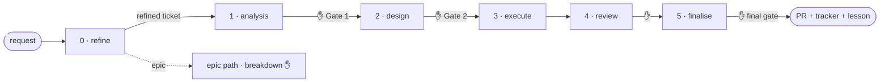

# mango-plugins


[](https://github.com/cuongdinhngo/mango-plugins/actions/workflows/validate.yml)

**mango** is a gated ticket workflow for Claude Code.

Instead of letting an AI coding agent decide a ticket is "done", mango forces every ticket through
explicit review gates, produces evidence at each stage, and waits for your approval before continuing.

> **Review evidence, not confidence.**

This repo is the **marketplace** that hosts mango ([`plugins/mango`](./plugins/mango)).

---

## Why mango?

AI coding agents are excellent at writing code. They are much less reliable at deciding whether the
work is actually complete. A ticket gets marked "done" while:

- one acceptance criterion was skipped
- a test proves the wrong thing
- an edge case was never considered
- documentation wasn't updated
- hidden assumptions remain

mango prevents this by routing every ticket through **gated phases** that each produce **checkable
artifacts** before the next phase can begin. You approve a diff on evidence, not vibes. Silence is
never approval.

---

## What you get

Every ticket produces:

- ✅ A **requirements matrix** with explicit counts — nothing slips through unnamed
- ✅ A **proving test at the right layer** — a runtime requirement can't be closed by a unit-mock proof
- ✅ An independent **challenger** that never sees the work — it rebuilds the requirements from the
  raw ticket and flags anything the diff leaves unmet
- ✅ **Human approval gates** before every important transition
- ✅ A **PR + tracker update + durable lesson**, each behind explicit per-action approval

---

## Quick start

In Claude Code:

```
/plugin marketplace add cuongdinhngo/mango-plugins
/plugin install mango@mango-plugins

/mango:init          # detect your stack, write .harness.json, scaffold a starter rule book
/mango:doctor        # health-check the setup (✅/⚠/❌ with remediation)
/mango:solve PROJ-123
```

That's enough to run your first ticket.

`/mango:init` detects your stack, writes `.harness.json`, scaffolds a starter rule book, marks every
inferred value `UNVERIFIED` for you to confirm, and writes **no secrets** — tokens live only in a
gitignored `.env`. To fill it by hand, copy `<plugin>/config/harness.example.json` to `.harness.json`
and edit `rulebook_path`, `repos`, `test_command`, `tracker`, and `ticket_header_schema`.

No rule book yet? Run `/mango:codify` — it **counts** the conventions your code and schema already
use, asks **you** to choose each standard, and records them as provisional until you ratify. mango
facilitates the rule book; it never writes the rules for you.

Once a lesson class has recurred across **two or more** tickets, `/mango:promote` proposes the rule it
should have become — grouped by class, citing every instance, with nothing written until you ratify each
candidate. It runs **between** tickets, because recurrence across tickets is invisible from inside one.

---

## The lifecycle

Six phases per ticket, each ending at a ✋ where you approve or send it back — plus a **Gate 0** for
clarifications when the ticket is ambiguous.


```mermaid
flowchart LR
    T([request]) --> RF["0 · refine"]
    RF -->|refined ticket| A["1 · analysis"]
    RF -.->|epic| BK["epic path · breakdown ✋"]
    A -->|✋ Gate 1| D["2 · design"]
    D -->|✋ Gate 2| E["3 · execute"]
    E --> R["4 · review"]
    R -->|✋| F["5 · finalise"]
    F -->|✋ final gate| OUT([PR + tracker + lesson])
```

| Phase | What it does |
|-------|--------------|
| **0 · refine** | Exposes the ticket's unresolved product decisions — resolves the *how* ones with a citation, asks you the *want* ones — then self-skips when the ticket is already clear. Never authors your intent. |
| **1 · analysis** | Decomposes every section into a counted requirements matrix, records a `BASELINE` for the existing test state, and gathers the Phase-1 evidence behind each row. |
| **2 · design** | The approach, the rejected alternatives, the smallest change-list traced to matrix rows, and a per-requirement verification plan whose layer-match — and, for an AC whose answer depends on the shape of real input, whose **fixture provenance** — is a hard gate. |
| **3 · execute** | Only the approved changes, on one branch, with the proving test — committed *before* review is dispatched. |
| **4 · review** | An independent, ticket-blind **challenger** rebuilds the requirements and judges the diff against them. |
| **5 · finalise** | PR draft, tracker update, and a durable lesson — one explicit approval per outward action. |

**Epics** take the epic path: thin epic-level analysis/design → **`breakdown`** into tickets, approved
by you before any executes.

**Run it:** `/mango:solve <KEY>` for the full lifecycle, any phase directly, or `/mango:quick <KEY>`
for the lite lane.

**Run it unattended:** `/mango:autorun <KEY>` runs the same phases overnight and closes each gate from
the artifacts they already emit, instead of waiting for you to type "go". **No gate is removed** — the
review seat included — and **there is no auto-merge**: the run stops when the PR exists, and the merge
stays yours. It writes a machine-parsed `RUN CONTRACT` before starting, a harness-run `RECONCILE` at t0
and after the last push, and a `DISCLOSURE` list of what was *not* verified, to read first in the
morning. `--no-reviewer` and `--no-challenger` (on `solve` too) waive the two review seats
**separately** — both run by default, neither flag implies the other, and each seat's state is recorded
on line one of that disclosure, so a morning reader can tell "clean, nobody looked" from "clean, the
blind reviewer looked".

---

## What the artifacts look like

`analysis` decomposes the ticket into a counted matrix, and the count is itself the gate — sections
found MUST equal sections decomposed:

```
SECTIONS: 7 found (Context, Scope, AC, Non-goals, Risks, Rollout, Metrics) | 7 decomposed
ROWS: C=2 R=7 G=3 AC=4
```

`review` fills a `k/N` on **every** matrix row and requires `k = N` to call the change clean, with
each shortfall named as a human-approved exclusion rather than waved through. An aggregate total is
deliberately not sufficient on its own — a "for each of N" requirement is checked item by item,
because a passing total can hide an incomplete tail. Frontend surface coverage blocks with its count
visible:

```
surfaces proven: 11/12
```

The ticket-blind `challenger` rebuilds the requirements from the raw ticket alone and returns a
numbered table — every item **met** / **not met** / **can't tell**, each with a `path:line` — then a
one-line summary:

```
1. AC-3  password reset invalidates the old token   met        src/auth/reset.ts:88
2. R-5   audit log entry written on failure         met        src/audit/log.ts:22
3. AC-4  rate limit applies to the reset endpoint   not met    —

14 requirements: 13 met, 1 not met, 0 can't tell
```

That output is never compressed — the per-requirement verdict and its evidence must survive in full.
On a clean verdict, review writes a `Reviewed at <sha>` marker into the working doc, so a later
commit can't quietly inherit an old review.

> These show the *shape* of the artifacts; exact fields depend on your project and ticket.

---

## Skills at a glance

The lifecycle skills are above. The rest are **supporting** — setup, diagnostics, and maps, none of
them gated: `init` · `doctor` · `codify` · `version-check` · `budget`, plus opt-in descriptive maps
`sitemap` (code surface) and `db-map` (database schema).

The **[plugin README](./plugins/mango/README.md)** has what each skill produces, plus phase-by-phase
detail, the lite/full tiers, the frontend track, and the model-delegation map.

---

## Maturity

**Every release is gated by `validate.py` and the dispatch-free script suites**, both run in CI on
every push.

**mango has no behavioural regression suite.** It has a per-skill smoke guard of 6 fixtures, run when
a skill is edited: it reports that those fixtures passed just now, and nothing more. Two limits are
stated rather than left to be discovered — it does **not** detect cross-skill regressions (editing
`design` and breaking `finalise` is not caught), and the `RETIRE:` counted line is uncovered.

**Why the suite was retired (1.16.0).** The 126-job behavioural suite that preceded it produced 30
reds over its whole life, of which **zero** were mango behaving wrongly: 12 were assertion wording,
10 were defects in the eval harness itself, 7 were environment, 1 was a fixture. It never caught a
cross-skill regression. Over the last 60 days it absorbed 86 commits against 25 to the behaviour
directories. Every defect it did find was a defect in itself; every defect found in mango's behaviour
was found by probing real data, by review, or in the field. The reasoning, the 24 harness defects it
surfaced, and the numbers are kept in [`tests/eval/history/`](./tests/eval/history/) so the decision
is auditable rather than repeated.

The public skill/config API has been stable since 1.0 **with one exception, in 1.14.0**: the `RUN
CONTRACT`'s `force-broken` / `force-holding` condition fields and `reconcile.py --prove` are removed.
Three field runs measured the forced-case control inert — every condition reported `FORCE-UNPROVEN` —
so it was retired rather than left as ceremony. A contract carrying either field is rejected with a
named reason, and `--prove` is refused rather than silently ignored.

Though written for Claude Code, mango is not locked to it: it has run its full lifecycle on other
hosts — including Cursor, driving real tasks to merged pull requests on a production codebase, with a
different underlying model.

The **unattended lane** (`/mango:autorun`, 1.11.0) is marked **Experimental**: its gate conditions are
the shipped, field-tested ones, and it has now driven real tickets to a pull request unattended — what
stays Experimental is the exact condition set a `RUN CONTRACT` should carry and the call-count budget
proxy — with one part of the condition set now settled and removed: the forced-case positive control
was measured inert across three runs and is retired. Its safety boundaries are not Experimental — no gate is removed, the review seat is never degraded
away, and there is no auto-merge.

The **counted-line checker** (`scripts/check_lines.py`, 1.13.0) is the newest surface. That the harness
parses a counted line rather than its author reading it is settled and is the point; **Experimental** is
the grammar registry's tolerance boundary — which spellings are inflection and which are a paraphrase.
Its safety boundaries are not Experimental: it reports and never rewrites, `not-checkable` is never a
pass, it adds no counted line of its own, and where it cannot run the run says so instead of claiming to
have checked.

**Evidence provenance** (1.14.0) is the newest surface on it: test evidence records the SHA of the tree
it ran against — for a containerised suite, the tree the **image was built from** — and a gate refuses
evidence from a different tree, reusing the stale-review guard's rule rather than building a second one.
Settled and not Experimental: `provenance-unknown` is a third state and never a pass, and an axis the
caller did not ask for is reported as absent rather than as clean. **Experimental** is how much of a
project's evidence the marker reaches: it binds the shipped `$ <command>` empirical-output shape, and
evidence recorded in some other shape is counted `provenance-unknown` rather than silently skipped.

Per-phase maturity (Stable / Experimental) is tracked in
[`plugins/mango/PRINCIPLES.md`](./plugins/mango/PRINCIPLES.md).

---

## Update

```
/plugin marketplace update mango-plugins
/plugin install mango@mango-plugins
```

---

## Contributing

Validating, running the smoke guard, and publishing are covered in
[CONTRIBUTING.md](./CONTRIBUTING.md).

One standing rule if you edit a skill: **skills are directive-only.** Skill text is runtime-loaded and
*is* behaviour, so a `SKILL.md` carries directives — never rationale, "observed failure" war-stories, or
historical justification. The rule goes in the skill; the reason goes in
[`plugins/mango/CHANGELOG.md`](./plugins/mango/CHANGELOG.md) and
[`plugins/mango/RATIONALE.md`](./plugins/mango/RATIONALE.md) (loaded by no skill).
`scripts/validate.py` enforces it.

---

## License

MIT — see [LICENSE](./LICENSE).
